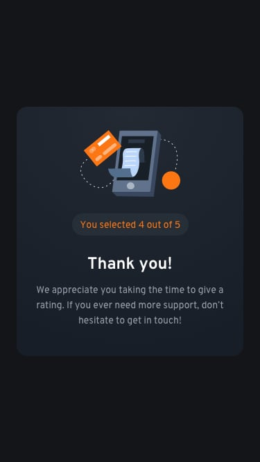

# Frontend Mentor - Solução do desafio "Interactive rating component"

Esta é uma solução do [Interactive rating component challenge on Frontend Mentor](https://www.frontendmentor.io/challenges/interactive-rating-component-koxpeBUmI). Os desafios do Frontend Mentor te ajudam a melhorar suas habilidades de programação ao te desafiar a fazer projetos do mundo real. 

## Visão Geral

### O desafio

Usuários devem poder:

- Ver o layout mais otimizado de acordo com o tamanho da tela
- Ver os elementos interativos ao colocar o mouse em cima
- Selecionar e enviar uma nota de avaliação
- Ver a tela de agradecimento após enviar a nota.

### Screenshot
Layout no computador

Layout no celular

## Processo

### Feito com

- HTML
- CSS
- Flexbox
- JavaScript

### Aprendizados

Nesse projeto, foi possível aprimorar as habilidades de JS, especialmente na parte de conseguir pegar a nota da avaliação enviada e conseguir renderizar na tela de agradecimento de forma correta.